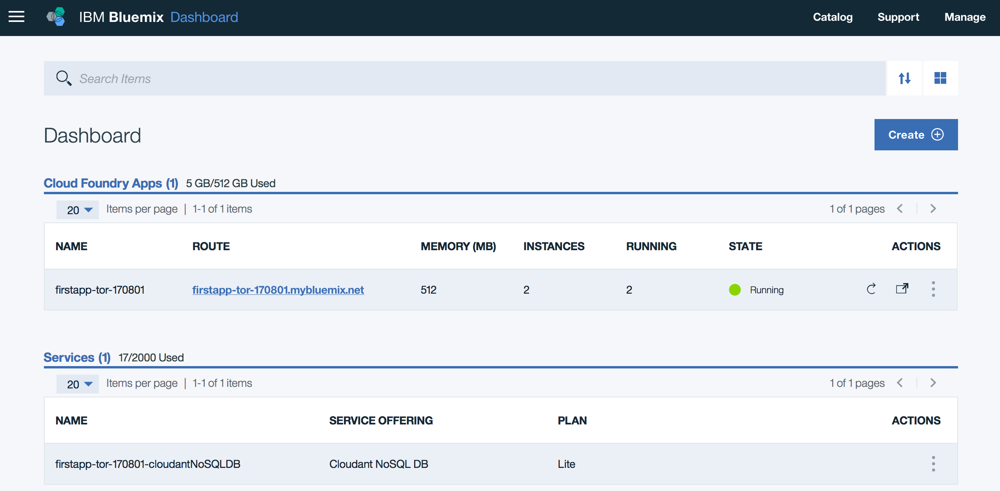

# Deploy your first Java App

© Copyright IBM Corporation 2017

IBM, the IBM logo and ibm.com are trademarks of International Business Machines Corp., registered in many jurisdictions worldwide. Other product and service names might be trademarks of IBM or other companies. A current list of IBM trademarks is available on the Web at &quot;Copyright and trademark information&quot; at www.ibm.com/legal/copytrade.shtml.

This document is current as of the initial date of publication and may be changed by IBM at any time.

The information contained in these materials is provided for informational purposes only, and is provided AS IS without warranty of any kind, express or implied. IBM shall not be responsible for any damages arising out of the use of, or otherwise related to, these materials. Nothing contained in these materials is intended to, nor shall have the effect of, creating any warranties or representations from IBM or its suppliers or licensors, or altering the terms and conditions of the applicable license agreement governing the use of IBM software. References in these materials to IBM products, programs, or services do not imply that they will be available in all countries in which IBM operates. This information is based on current IBM product plans and strategy, which are subject to change by IBM without notice. Product release dates and/or capabilities referenced in these materials may change at any time at IBM&#39;s sole discretion based on market opportunities or other factors, and are not intended to be a commitment to future product or feature availability in any way.

***

# Overview

In this lab you will see how to deploy a boilerplate Cloud Foundry application using the Bluemix console or Web UI. You will learn how to navigate through the Web UI, including basic tasks like managing your current organization, current Cloud Foundry space, and managing deployed applications and service instances.

## Prerequisites

* Bluemix supported [web browser](https://console.ng.bluemix.net/docs/overview/prereqs.html#prereqs)
* an IBMid which is configured with a Bluemix account

# Step 1: Getting in and around with Bluemix
In this section you will sign into Bluemix and learn the major components available through the Bluemix console.

1.  In a web browser navigate to your default Bluemix region with this URL

    * https://console.bluemix.net

2.  Select **Log in**

    

3.  Next, enter in the IBMid or email address for your Bluemix account

4.  Provide the account Password, and click on **Log in**

5.  The IBM Bluemix Dashboard will appear. Examine the sections beginning at the top. There is an upper bar with account information and a profile avatar on the right hand side, and a link to Docs on the left side. Click on the **account information** to expand the account, region, organization, and space selection panel.

    

    When you start in Bluemix, you will have just a single space, and usually be a member of just one organization. Organizations can be used by account administrators to separate groups of users for Bluemix platform services. The space is a logical partition within an organization. In Cloud Foundry, each space provides a common place for applications to be associated with services, for example a database or messaging service.

    Each region of Bluemix is a self-contained collection of components providing all Cloud platform services for that region. For this lab, you can work in your default region, and you don't need to change your organization or current space.

6.  **Click** anywhere on the browser panel to make the account panel vanish.

7.  Click on the **Docs** link in the upper left to open a new browser tab with the Bluemix documentation. The documentation is organized into general platform information about Bluemix and then specific compute and service topics. The documentation items shown will vary based on the catalog services available in version of Bluemix that you are using.

8.  Scroll down to the Compute & Services area and locate the **Cloudant NoSQL DB** item and click on it to bring up the documentation for the service. You will notice that the documentation has getting started, usage, and reference information. Many documentation pages also include short tutorials inline that you can use to get a quick introduction on how a Bluemix compute platform or service works.

9.  Return to the Bluemix dashboard tab. In the second top panel there is a menu selector (three horizontal lines) on the left side and on right side there are links to the Bluemix service *Catalog*, links for *Support*, and *Account* management options.

10. Click on the **Catalog** item to open the Bluemix catalog. The catalog displays a filterable list of categories on the left and a scrollable pane of tiles in the middle. You can type in the search panel to filter what is displayed in the tile pane.

# Step 2: Creating a sample application
In this section you will create an application using an application template called a boilerplate. Bluemix provides a few boilerplates to give examples of how to use runtimes and services. Each boilerplate combines a cloud foundry runtime, one or more services, and some application code for the runtime.

1.  From the catalog, select **Boilerplates** in the left-side category list to display the available boilerplates.

2.  Find the **Java Cloudant Web Starter** tile and click on it to bring up the application configuration panel.

    

3.  Assign a name to the application by typing in the **App name:** field. Note that the **Host name:** field is automatically populated with the same value. The *application name* will be used as a reference to the application within Bluemix, while the *host name* will be added to the domain (which will default to mybluemix.net in Bluemix Public) to create the full application *route*.

    Since each application is mapped to the mybluemix.net domain, you will be required to choose a unique name for use in the host name. Do this by appending your initials and date to a name like `myfirstapp`. For example `myfirstapp-tor-170801`. After setting the **App name:**, leave all the other options at the defaults and click on **Create**.

4.  After a moment the application dashboard will open and start with the *Getting Started* panel selected. The contents of this panel will vary from one application to another. For Bluemix boilerplates, instructions on how to download the source code, make changes, and then update the application with the changes are shown.

    

    Click on the **DOWNLOAD STARTER CODE** button while you are waiting for the application to finish starting. This will download a copy of the source code for the Java application to your workstation.

5.  When the application has started, the status will change and a **Visit App URL** link will appear.

    

    Click on **Visit App URL** to open the application in a new tab. Notice how the URL bar in the tab shows the name you selected.

# Step 3: Managing Bluemix Cloud Foundry applications using the Web UI
With an application running, in this section you will learn the display panels for an application and also look at how the Bluemix dashboard displays running applications and services.

1.  Return to the browser tab with the application dashboard. On the left navigation, select **Overview** to access the application overview panel. This panel displays information about the Cloud Foundry runtime including the number of copies (instances) of the application and the amount of memory used by each instance. It also gives an overview of the Bluemix services that are connected to the application and a feed of current events.

2.  Horizontally scale the application by clicking on the plus icon for the instance count to increase to 2 and then click on **Save**.

    

    A warning screen will be shown. This is appearing because the original deployment manifest used for the application specified 1 instance. If the application is re-deployed, the manifest settings will override *any* changes made in the Web UI. Click on **Close** to clear the warning message.

    You can still access the application while the new instance is starting. Go to the browser tab with the application open and reload the page to see!

3.  When the second instance is confirmed as started the health will show as 100%. Click on **Runtime** item in the left navigation to bring up details of the running instances.

4.  In the *Runtime* panel you will see selectors for **Memory and instances**, **Envrionment Variables**, and **SSH**. Stay on the **Memory and instances** view for now and scroll down. You will see both instances listed and the current CPU, memory and disk usage along with when the instance was most recently started.

5.  Scroll up and select **Environment Variables**. This will display the credentials of every service that is connected to the application along with any user-defined environment variables. Application credentials in Cloud Foundry are placed in the VCAP_SERVICES environment variable. To securely access services, Cloud Foundry applications read these credentials from the environment instead of relying on configuration files.

6.  On the left navigation, click on **Connections** to bring up the application connections panel. Here you will see a single Cloudant NoSQL DB service tile showing that it is connected to your application.

    

7.  Click on the **Cloudant NoSQL DB** connection tile to bring up the service control panel in the current browser tab. Each service in Bluemix has a control panel that allow you to manage the service, access the credentials, view the service plan and find the applications that are connected to the service.

    Cloudant has its own management dashboard which is accessible from the **Launch** button. In a later lab module you will learn how to work with this dashboard.

8.  Navigate back to the Bluemix dashboard by clicking on the Menu bars in the upper left and selecting **Dashboard**. You will see a view of the applications and services in the current space (just one of each).

    

9.  Go back into the application dashboard for your boilerplate application by clicking on the **name** (not the route) of the application. In the left navigation, click on **Logs** to bring up the log panel.

10. In the logs panel click on the right hand **Filter** button and select **RTR** and both application instances.

    

    Depending on the number of times that you have accessed the application, you may see one or several entries. Go to the browser tab with the application and reload the page a couple of times. This will add more log entries. Each log entry of type RTR corresponds to traffic coming into Bluemix and passing through the router component.

    Each Bluemix component uses a specific prefix which allows you to drill down into a specific aspect of the overall logging stream. All application output to standard out will appear here as APP/ entries. Calls to the Cloud Foundry API endpoint are logged as API/ and so on.

11. You may experiment with the application by uploading a file. Use the **Browse** button to choose a file and the **Upload** button to send it to the Cloudant NoSQL database that is backing the application. **Note:** only upload non-sensitive content as the application does not implement security and is reachable from any internet location. The application logic to handle attachments is implemented through the /attach REST API endpoint created in the application code.

## Summary
In this lab you created a sample application and learned how to work with the Bluemix Web UI. Check with your instructor on any steps that should be performed to remove the application and service, or if they will be used in a subsequent lab module.
