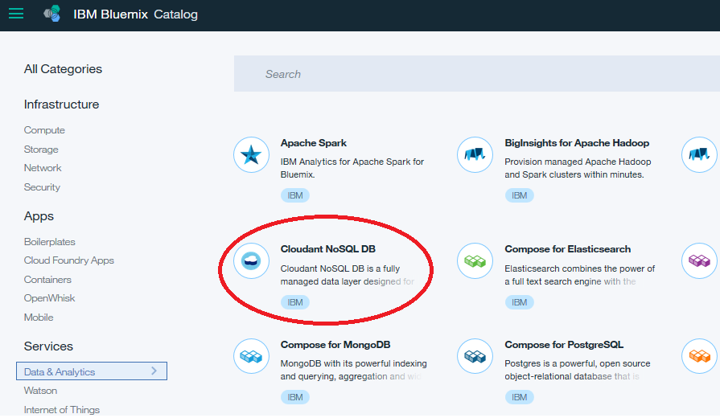

# Managing Cloudant Databases

© Copyright IBM Corporation 2017

IBM, the IBM logo and ibm.com are trademarks of International Business Machines Corp., registered in many jurisdictions worldwide. Other product and service names might be trademarks of IBM or other companies. A current list of IBM trademarks is available on the Web at &quot;Copyright and trademark information&quot; at www.ibm.com/legal/copytrade.shtml.

This document is current as of the initial date of publication and may be changed by IBM at any time.

The information contained in these materials is provided for informational purposes only, and is provided AS IS without warranty of any kind, express or implied. IBM shall not be responsible for any damages arising out of the use of, or otherwise related to, these materials. Nothing contained in these materials is intended to, nor shall have the effect of, creating any warranties or representations from IBM or its suppliers or licensors, or altering the terms and conditions of the applicable license agreement governing the use of IBM software. References in these materials to IBM products, programs, or services do not imply that they will be available in all countries in which IBM operates. This information is based on current IBM product plans and strategy, which are subject to change by IBM without notice. Product release dates and/or capabilities referenced in these materials may change at any time at IBM&#39;s sole discretion based on market opportunities or other factors, and are not intended to be a commitment to future product or feature availability in any way.

***

Overview
========

In this lab, learn the basics of managing the Cloudant NoSQL Database data service in IBM Bluemix. You will see how to create databases, documents, secondary indexes using map functions, Cloudant Query indexes, and setting up Replication.

Prerequisites
-------------

-   [IBM Bluemix account](https://developer.ibm.com/sso/bmregistration?lang=en_US).

-   An IBM Bluemix-supported [web browser](https://console.ng.bluemix.net/docs/overview/prereqs.html#prereqs) such as Internet Explorer, Safari, Firefox, or Chrome

**Manage instances of a Cloudant NoSQL database**

Step 1. Create a Cloudant database instance
===========================================

1.  From a browser, [log in](http://bluemix.net/) to Bluemix.

2.  From the Apps Dashboard, click **Catalog** to open the service catalog.

3.  Select the **Data and Analytics** section, and then click **Cloudant NoSQL DB**.

    

4.  Under Connect to, select **Leave unbound**.

5.  Click **Create** to create a new instance of Cloudant NoSQL DB.

6.  Click **LAUNCH** from the service console to launch the dashboard.

    

Step 2. Create a database
=========================

1.  Click **Databases** to open the
    database panel.

    

2.  Click **Create Database**, enter `mydatabase` as the name, and then click **Create.**

    You will be taken to the database administration page for the new database.

   

Step 3. Add data to an existing database
========================================

1.  Click the **Add** (**+**) icon next to **All Documents,** and select **New Doc** from the context menu.

    

    A new JSON document appears with a single attribute named \_id. This is the unique identifier of your new document.

2.  Modify the **\_id** value, and add the fields **field2** and **field3** using:

    ```
    {
      "_id": "myuniqueid1",
      "field2": "value2",
      "field3": "value3"
    }
    ```

    

3.  Click **Create Document** to save your changes and return to the database view.

Step 4. Clone documents in a database
======================================


1.  The database view now shows your all of the documents (of which there is one). To see the contents of a document, select the **JSON** view.

    

2.  Click the **Edit** (pencil) icon of the document to edit it.

    

2.  Click **Clone Document** in the
    document editor.

    You’ll be prompted to accept a system-generated unique ID for the new clone or to provide your own value.

3.  Change the ID to myuniqueid2.

    

4.  Click **Clone Document**. Your clone is added to the database.

5.  Click the database name to go back to the database view.

    

Step 5. Edit documents in a database
====================================

1.  From the database view in the Dashboard, click **JSON**.

    A summary of the documents in the database appears on the right.

    

2.  Click the **Edit** (pencil) icon of your document with the \_id of
    “myuniqueid2” to edit it.

3.  Update the value for **field2**.

    

4.  Click **Save Changes** to save your changes and return to the database view.

Step 6. Create a simple query a of specific document in the database by key
================================================================

1.  Click **Options**, check the **Include Docs**. Select **By key(s)** and then enter `["myuniqueid1"]` into the panel.

    

    Click on **Run Query**.

2.  A table view is shown matching the documents from your query.

    

Step 7. Create a secondary index using a view with a map function
=================================================================

1.  Click the **Add** (**+**) icon next to **All Documents,** and select **New View** from the context menu.

2.  In the **\_design/** field, enter `myview1` as
    the name.

3.  Update the *Map function* to read:

    ```
    function (doc) {
      if (doc.field2) {
        emit(doc._id, doc.field2);
      }
    }
    ```

    This will look at each document and check to see if a field called `field2` is present. If it is, the function will return the document id and the value of that field.

4.  Click **Create Document and then Build Index** to create the index. The view is immediately opened and shows a set of returned documents from the index.

    

    Note how the returned documents in the view have a key that is equal to the original document ID and a value corresponding to the value that was set in the **field2** field.

    You can also access this view directly like an API. Copy the url shown in the browser to a new tab and remove the `dashboard.html#/database/` element from the path and load the page.

    

Step 8. Build an index for use with Cloudant Query
==================================================

1.  Click the **Add** (**+**) icon next to **All Documents,** and select **Query Indexes** from the context menu.

2.  In the Cloudant Query index editor,
    change the default field of `foo` to `field2`.

3.  Keep the index type set to `json`.

4.  Click **Create Index**. Cloudant will create the index and display status updates along the top of the Dashboard page.

5.  After confirmation that the index has been created, click on the database name to return to the database view.

6.  Click **Query.**

    

7.  In the Query editor, update the selector to choose documents where “field2” is equal to “value2.”

8.  Simplify the query by removing the fields and sort options. When finished, the query will look like:

    ```
    {
      "selector": {
        "field2": "value2"
      }
    }
    ```

3.  Click **Run Query** to display the results of the query.

    

    The document matched by the query is shown with all of the document fields.

Step 9. Setup replication for a sample database
===============================================

1.  From the Cloudant dashboard, click the **Replication** tab.

    

2.  Click on **New Replication** button.

3.  Complete the form on the right side of the screen to create a new replication job with the following specifications:

-   **Replication Source:** **Remote database**
    In this tutorial, you want to replicate a database from the
    Education account to your own personal account, so indicate that the
    source database is a remote database.

    -   **Database URL**: https://education.cloudant.com/foundbite

    -   For the **Replicaton Target** database, click **New local Database**, and then specify the database name as `foundbite`.

    > **Tip**: The source and target databases can be within the same account, between two different accounts, or one remote and one local.

    -   **Replication type**: **One time** Replication can be one time or continuous.

    -   Just like any document in any other Cloudant database, you can either use the auto-generated document ID, or provide your own. For
    this tutorial, type `foundbite_replication`.

    

4.  Click **Start Replication**.

5.  Enter your password. This is the Cloudant service password and not your Bluemix account password. To get this password, open the Cloudant service control panel and copy the password from the service credentials, or inspect an application that is bound to the Cloudant service and obtain the credentials from the `VCAP_SERVICES` envrionment variable

6.  Click **Continue**.

    > You get the success message: Replication from *sourceDb* to *targetDB* has been scheduled.

7.  Click the **Replication** tab and look under Replicator DB Activity to verify that replication completed.

    

8.  Click the **Databases** tab, and verify that the **foundbite**
    database was created.

    

9.  Open one of the documents.

10. For more practice, try copying documents from the `mydatabase` database to another Cloudant instance in your account.

Summary
=======

You’ve now learned the basics of managing the Cloudant NoSQL Database data service in IBM Bluemix.
